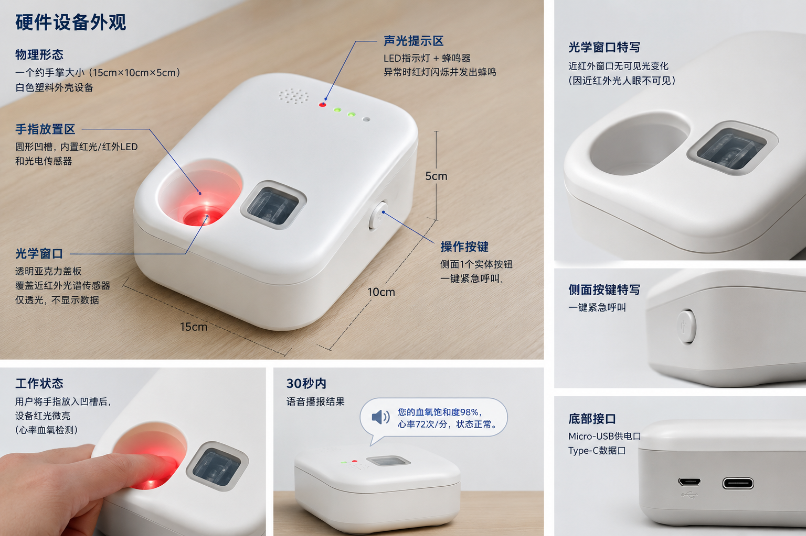

# 基于边缘 AI 的多模态居家健康监护与无创血糖概念演示系统

**EdgeAI MultiModal Home Health Monitor & Non-Invasive Glucose Proof-of-Concept System**

---

## 一、项目名称

- **中文名称**：基于边缘 AI 的多模态居家健康监护与无创血糖概念演示系统
- **英文名称**：EdgeAI MultiModal Home Health Monitor & Non-Invasive Glucose Proof-of-Concept System

---

## 二、项目简介（一句话定位）

用多模态生理感知与边缘 AI 分析技术，为居家老年患者解决传统有创血糖监测疼痛、耗材成本高、操作繁琐、数据零散、远程监护缺失的痛点，实现无创自主检测、AI 智能分析、语音交互、远程家属联动监护一体化价值。

---

## 三、Web 门户系统

本项目包含四个 Web 前端应用，采用现代化的前端技术栈构建：

### 项目结构

```
web-portal/
├── patient/      # 患者端 - 纯 HTML 页面
├── family/       # 家属端 - Vue3 + Vue Router
├── dashboard/    # 数据大屏 - Vue3
└── admin/        # 管理后台 - Vue3 + Element Plus + Pinia
```

### 各端功能详解

#### 患者端 (patient)
**定位**：为老年患者提供简单直观的健康数据录入界面

**功能列表**：
- 健康数据录入界面
- 一键紧急呼叫
- 语音提示引导
- 纯 HTML 静态页面，无需复杂操作

#### 家属端 (family)
**定位**：家属远程监护平台，实时掌握患者健康状况

**功能列表**：
- **实时数据查看**：心率、血氧、体温等实时生理数据
- **历史数据查询**：按时间范围查询历史健康记录
- **告警通知**：异常数据实时推送预警
- **视频通话**：与患者进行双向视频通话
- **健康报告**：生成周期性健康分析报告
- **患者管理**：管理多个被监护患者信息

**技术栈**：Vue 3 + Vue Router 4 + Axios

#### 数据大屏 (dashboard)
**定位**：可视化数据展示中心，适合监护中心大屏展示

**功能列表**：
- **实时数据展示**：所有在线设备的实时数据流
- **24 小时趋势图**：关键指标的 24 小时变化曲线
- **统计信息**：在线设备数、告警数、健康率等统计
- **告警列表**：实时滚动的告警信息列表
- **健康状态热力图**：按时间段展示健康状态分布

**技术栈**：Vue 3 + ECharts（可视化图表库）

#### 管理后台 (admin)
**定位**：系统管理员配置和管理平台

**功能列表**：
- **仪表盘**：系统整体运行状态概览
- **用户管理**：患者账户、家属账户的增删改查
- **设备管理**：绑定设备与患者、设备状态监控
- **系统配置**：告警阈值配置、系统参数设置
- **数据管理**：数据备份、导出、清理
- **日志查看**：系统运行日志、操作审计日志

**技术栈**：Vue 3 + Vue Router 4 + Pinia + Element Plus

### 启动方式

#### 患者端
直接用浏览器打开 `web-portal/patient/index.html`

#### 家属端
```bash
cd web-portal/family
npm install
npm run dev
```
访问 http://localhost:3001

#### 数据大屏
```bash
cd web-portal/dashboard
npm install
npm run dev
```
访问 http://localhost:3002

#### 管理后台
```bash
cd web-portal/admin
npm install
npm run dev
```
访问 http://localhost:3003

### 构建部署

#### 构建命令
```bash
# 家属端
cd web-portal/family
npm run build

# 数据大屏
cd web-portal/dashboard
npm run build

# 管理后台
cd web-portal/admin
npm run build
```

#### 预览构建结果
```bash
# 家属端
cd web-portal/family
npm run preview

# 数据大屏
cd web-portal/dashboard
npm run preview

# 管理后台
cd web-portal/admin
npm run preview
```

### 技术栈总览

| 技术 | 版本 | 用途 |
|------|------|------|
| **前端框架** | Vue 3 | UI 框架 |
| **路由** | Vue Router 4 | 页面路由管理 |
| **状态管理** | Pinia | 全局状态管理 |
| **UI 组件** | Element Plus | 管理后台 UI 组件库 |
| **HTTP 客户端** | Axios | API 请求 |
| **构建工具** | Vite 5 | 开发和构建工具 |
| **时间处理** | Day.js | 日期时间处理 |

### 开发环境要求

- Node.js >= 16.0.0
- npm >= 8.0.0

---

## 四、快速入门（面向小白，5 分钟可上手）

### 前置条件

| 类别 | 要求 |
|------|------|
| **硬件** | ESP32-S3-EYE 开发板 ×1、MAX30102 心率血氧传感器 ×1、MLX90614 红外体温传感器 ×1、近红外光谱传感器 ×1、树莓派 5 ×1、语音播报喇叭 ×1、声光报警模块 ×1、DC 稳压供电模块 ×1 |
| **系统环境** | 树莓派 5 运行 Raspberry Pi OS（64 位）、Python 3.8+、ESP-IDF 5.0+ |
| **传感器连接** | 传感器通过杜邦线连接至 ESP32-S3-EYE，通过 I²C/UART 通信（无需焊接） |
| **网络** | WiFi 环境（2.4GHz/5GHz 双模） |

### 安装步骤

#### 1️⃣ 硬件连接

```
ESP32-S3-EYE 接线说明：
┌──────────────────────────────┐         ┌──────────────────────┐
│   MAX30102 心率血氧传感器       │         │     ESP32-S3-EYE      │
├──────────────────────────────┤         ├──────────────────────┤
│  VCC (5V)    │ ────────────→│  5V     │  电源输入             │
│  GND         │ ────────────→│  GND    │  接地                 │
│  SCL         │ ────────────→│  GPIO22 │  I²C 时钟              │
│  SDA         │ ────────────→│  GPIO21 │  I²C 数据              │
└──────────────────────────────┘         └──────────────────────┘

┌──────────────────────────────┐         ┌──────────────────────┐
│   MLX90614 红外体温传感器       │         │     ESP32-S3-EYE      │
├──────────────────────────────┤         ├──────────────────────┤
│  VCC (5V)    │ ────────────→│  5V     │  电源输入             │
│  GND         │ ────────────→│  GND    │  接地                 │
│  SCL         │ ────────────→│  GPIO22 │  I²C 时钟（共用）      │
│  SDA         │ ────────────→│  GPIO21 │  I²C 数据（共用）      │
└──────────────────────────────┘         └──────────────────────┘
```

#### 2️⃣ ESP32-S3-EYE 固件烧录

```bash
# 进入固件目录
cd firmware/esp32-s3

# 配置 ESP-IDF 环境
export IDF_PATH=$HOME/esp/esp-idf
source $IDF_PATH/export.sh

# 编译并烧录
idf.py set-target esp32s3
idf.py build
idf.py -p /dev/ttyUSB0 flash
idf.py -p /dev/ttyUSB0 monitor
```

#### 3️⃣ 边缘服务部署

```bash
# 进入服务目录
cd services/raspberry-pi

# 创建虚拟环境
python -m venv venv
source venv/bin/activate

# 安装依赖
pip install -r requirements.txt

# 初始化数据库
python scripts/init_db.py

# 启动服务
python main.py
```

### 运行演示命令

```bash
# 启动完整系统
docker-compose up -d

# 查看实时日志
docker-compose logs -f

# 触发一次健康检测
curl -X POST http://localhost:8080/api/v1/detect
```

### 预期效果

- 设备启动后自动连接 WiFi
- 传感器数据实时采集并显示在本地终端
- 语音播报当前健康状态
- 异常数据触发声光报警
- 家属端收到预警通知（如已配置）

---

## 五、产品功能与特征

### 竞品对比

| 功能项 | 本产品 | 传统有创血糖仪 | 智能手表健康功能 |
|--------|--------|---------------|-----------------|
| **检测方式** | 无创多模态感知 | 指尖采血 | 单一 PPG 传感 |
| **疼痛感** | 无痛 | 明显疼痛 | 无痛 |
| **耗材成本** | 零成本 | 2-5 元/次 | 零成本 |
| **检测频次** | 高频复测 | 低频受限 | 持续监测 |
| **AI 分析能力** | 基线学习 + 异常检测 | 无 | 基础阈值 |
| **语音交互** | 全程播报 | 无 | 部分支持 |
| **远程监护** | 双向通话 + 预警 | 无 | 单向推送 |
| **适老化设计** | 专为老年优化 | 操作复杂 | 需屏幕操作 |

### 核心特征

| 特征类别 | 具体能力 |
|----------|----------|
| **无创检测** | 近红外光谱 + 多模态生理信号融合 |
| **AI 分析** | 健康基线学习、异常检测、趋势研判 |
| **语音交互** | 检测播报、异常解读、周期总结、操作指引 |
| **远程监护** | 家属端实时查看、异常预警、双向通话 |
| **数据溯源** | 本地存储 + 云端备份、趋势曲线、周期报表 |
| **安全加密** | TLS/SSL 传输、AES-256 存储、Token 鉴权 |

---

## 六、产品工作原理（How it works）

### 技术路线

```
数据采集 → 预处理 → 核心分析 → 结果输出
  硬件层      硬件层      服务层      展示层
```

### 分步说明

**步骤 1：数据采集（硬件层）**
- MAX30102 采集心率、血氧饱和度（I²C 通信）
- MLX90614 采集体表温度（I²C 通信）
- 近红外光谱传感器采集皮肤组织光学特征（UART 通信）
- ESP32-S3-EYE 统一汇聚多模态数据

**步骤 2：预处理（硬件层）**
- 滤波降噪：去除环境干扰和传感器噪声
- 环境光抑制：消除外部光线对光学信号的影响
- 温度补偿：校正环境温度对测量的影响
- 数据打包：标准化格式加密上传

**步骤 3：核心分析（服务层）**
- 数据校验：检查数据完整性和合理性
- 健康基线学习：建立用户个人化健康模型
- 异常检测：识别偏离基线的异常状态
- 趋势研判：单次 + 周期多维度分析
- 建议生成：匹配饮食、运动、作息建议

**步骤 4：结果输出（展示层）**
- 语音播报：健康状态、异常解读、周期总结
- 声光报警：高危情况本地提醒
- 数据展示：趋势曲线、周期报表
- 远程联动：家属端推送、双向通话

### 系统架构图

```
┌─────────────────────────────────────────────────────────────────┐
│                              展示层                               │
│  ┌─────────────────────────────┐     ┌─────────────────────────┐ │
│  │       本地用户端             │     │      家属监护端          │ │
│  │       (患者端)               │     │      (远程端)            │ │
│  ├─────────────────────────────┤     ├─────────────────────────┤ │
│  │  数据可视化                  │     │  远程数据查看           │ │
│  │  语音播报                    │     │  异常预警接收           │ │
│  │  一键呼叫                    │     │  主动通话               │ │
│  └─────────────────────────────┘     └─────────────────────────┘ │
└─────────────────────────────────────────────────────────────────┘
                               ↕ 加密通信
┌─────────────────────────────────────────────────────────────────┐
│                              服务层                               │
│  ┌───────────────────────────────────────────────────────────┐  │
│  │           边缘算力平台 (树莓派 5)                            │  │
│  ├───────────────────────────────────────────────────────────┤  │
│  │  数据校验存储    AI 健康基线学习                             │  │
│  │  异常检测判定    单次 + 周期趋势分析                         │  │
│  │  健康建议生成    远程通话调度                               │  │
│  │  语音播报调度    本地数据缓存                               │  │
│  └───────────────────────────────────────────────────────────┘  │
└─────────────────────────────────────────────────────────────────┘
                               ↕ 无线通信
┌─────────────────────────────────────────────────────────────────┐
│                              硬件层                               │
│  ┌───────────────────────────────────────────────────────────┐  │
│  │         多模态采集终端 (ESP32-S3-EYE)                       │  │
│  ├───────────────────────────────────────────────────────────┤  │
│  │  近红外光谱采集   MAX30102 心率血氧                         │  │
│  │  MLX90614 体温     滤波降噪处理                             │  │
│  │  温度补偿         数据预处理上传                            │  │
│  └───────────────────────────────────────────────────────────┘  │
└─────────────────────────────────────────────────────────────────┘
```

---

## 七、AI 协同开发说明

### 开发全流程 AI 辅助

本项目在开发过程中使用 AI 工具辅助完成代码编写、文档生成、测试用例设计等工作。所有 AI 生成内容均经过人工审核、测试验证后提交。

**AI 工具应用范围**：
- 需求分析：辅助拆解需求、生成功能清单
- 架构设计：生成架构方案、对比多种技术路线
- 代码编写：生成代码框架、单元测试
- 文档编写：生成 API 文档、README、用户手册
- 测试验证：生成测试用例、边界条件

---

## 八、技术来源

### 行业现有技术方案及问题

| 技术方案 | 存在问题 |
|----------|----------|
| **有创血糖仪** | 疼痛、耗材成本高、监测频次低 |
| **智能手表** | 单一传感、精度不足、无专业医疗认证 |
| **连续血糖监测 (CGM)** | 植入式、成本高、需定期更换传感器 |

### 改进与创新

本方案在现有基础上进行以下改进：

1. **多模态融合**：心率 + 血氧 + 体温 + 近红外光谱，提升数据维度
2. **边缘 AI**：本地运算为主，降低云端依赖，提升实时性
3. **语音交互**：专为老年用户设计，降低操作门槛
4. **远程监护**：双向通话 + 异常预警，解决居家监护盲区

### 参考技术

- ESP32-S3-EYE 官方 SDK 及示例代码
- 树莓派官方文档及开源项目
- 近红外光谱检测技术专利文献
- 医疗级生理信号处理算法论文

---

## 九、技术壁垒与核心保护

### 核心壁垒

**壁垒在于：**

1. **多模态数据集**：积累的多模态生理数据与健康状态关联数据
2. **AI 模型**：健康基线学习算法、异常检测模型
3. **行业经验**：老年用户交互设计、居家监护业务流程

### 开源策略

| 内容 | 开源/闭源 | 说明 |
|------|-----------|------|
| **调用层代码** | 开源 | API 接口、配置文件示例 |
| **子系统代码** | 开源 | 预处理、UI 展示、示例代码 |
| **核心 AI 模型** | 闭源 | 不对外提供模型权重 |
| **核心数据集** | 闭源 | 不对外提供训练数据 |
| **核心算法** | 闭源 | 通过 API 提供服务 |

---

## 十、路线图

### 版本规划

| 版本 | 完成状态 | 核心目标 | 关键功能 |
|------|----------|----------|----------|
| **v0.1** | 开发中 | 基础功能跑通 | 心率血氧采集、体温采集、本地存储、基础语音播报 |
| **v0.2** | 规划中 | 光学通道接入 | 近红外光谱采集、多模态数据融合、边缘 AI 分析 |
| **v0.3** | 规划中 | 远程监护完善 | 家属端开发、双向通话、异常预警推送 |
| **v1.0** | 规划中 | 产品化发布 | 系统优化、稳定性提升、商业授权体系 |

### 迭代原则

**先可靠、再探索**

1. **一期**：心率、血氧、体温核心通道全流程跑通
2. **二期**：近红外光谱探索通道接入与数据关联分析
3. **三期**：模型精度优化、系统稳定性提升、慢病管理功能完善

---

## 十一、项目配置与 API 手册

### 配置文件说明

配置文件位于 `config.yaml`，主要配置项：

```yaml
# 设备配置
device:
  serial_port: "/dev/ttyUSB0"
  baud_rate: 115200

# 网络配置
network:
  wifi_ssid: "your_wifi"
  wifi_password: "your_password"

# AI 模型配置
ai:
  model_enabled: true
  threshold:
    heart_rate_low: 50
    heart_rate_high: 100
    spo2_low: 95
    temp_high: 37.5

# 语音配置
voice:
  enabled: true
  volume: 80
  language: "zh-CN"
```

### API 示例

#### 触发健康检测

```python
import requests

# 触发检测
response = requests.post(
    "http://localhost:8080/api/v1/detect",
    headers={"Authorization": "Bearer YOUR_API_KEY"},
    json={"device_id": "device_001"}
)

print(response.json())
# 返回：{"status": "success", "data": {"heart_rate": 72, "spo2": 98, "temp": 36.5}}
```

#### 获取历史数据

```python
# 获取最近 7 天数据
response = requests.get(
    "http://localhost:8080/api/v1/history?days=7",
    headers={"Authorization": "Bearer YOUR_API_KEY"}
)

print(response.json())
```

---

## 十二、许可证与合规

### 开源协议

| 内容 | 协议 |
|------|------|
| **仓库开源代码** | MIT License |
| **核心闭源系统** | 商业授权 |

### 合规声明

- 本系统为概念演示系统，不提供医疗诊断功能
- 健康数据仅供参考，不作为医疗决策依据
- 用户健康数据采用加密存储与传输，符合隐私保护要求

---

## 十三、仓库首页展示内容

### 硬件概念设计图



> ⚠️ **注**：以上为 AI 生成的概念设计图，用于展示产品外观设计方案。实物照片待硬件组装完成后补充。

#### 设计规格

| 项目 | 参数 |
|------|------|
| **物理形态** | 手掌大小 (15cm × 10cm × 5cm) |
| **外壳材质** | 白色塑料 |
| **核心组件** | 光学传感器、LED 指示灯、操作按键 |
| **接口** | Micro-USB 供电口、Type-C 数据口 |

#### 功能区域说明

| 区域 | 功能 |
|------|------|
| **手指放置区** | 圆形凹槽，内置红光/红外 LED 和光电传感器 |
| **光学窗口** | 透明亚克力盖板，覆盖近红外光谱传感器 |
| **声光提示区** | LED 指示灯 + 蜂鸣器，异常时红灯闪烁并发出蜂鸣 |
| **操作按键** | 侧面 1 个实体按钮，一键紧急呼叫 |

---

### 当前阶段展示材料（概念演示阶段）

由于项目处于概念演示阶段，仓库使用 AI 生成的概念设计图作为视觉展示材料。

| 内容类型 | 说明 |
|----------|------|
| **硬件概念设计图** | AI 生成的产品外观概念图，展示设计规格与功能区域 |
| **系统界面截图** | 数据展示界面、预警界面、家属端界面 |
| **演示视频** | AI 生成演示视频，展示完整检测流程概念 |

### 未来实物展示清单（待完成）

硬件组装完成后将补充以下材料：

- [ ] 硬件组装完成照（正面/侧面）
- [ ] 传感器连接特写
- [ ] 检测过程 GIF
- [ ] 语音播报场景照
- [ ] 异常预警触发演示
- [ ] 家属端界面截图
- [ ] 1 分钟演示视频

---

## 附录：系统硬件物料清单（BOM）

| 序号 | 物料名称 | 规格参数 | 数量 | 核心用途 |
|------|----------|----------|------|----------|
| 1 | ESP32-S3-EYE 开发板 | WiFi/蓝牙双模，UART/I²C 接口 | 1 块 | 前端采集主控 |
| 2 | MAX30102 心率血氧传感器 | I²C 通信，PPG 采集 | 1 个 | 核心生理数据通道 |
| 3 | MLX90614 红外体温传感器 | I²C 通信，非接触测温 | 1 个 | 核心生理数据通道 |
| 4 | 近红外光谱传感器 | 800-1300nm 波段，UART 输出 | 1 个 | 光学探索通道 |
| 5 | 树莓派 5 开发板 | 四核处理器，WiFi/蓝牙 | 1 台 | 边缘算力平台 |
| 6 | 语音播报喇叭模块 | 5V 供电，高保真音质 | 1 个 | 语音交互输出 |
| 7 | 声光报警模块 | 5V 供电，分级报警 | 1 个 | 异常本地提醒 |
| 8 | DC 稳压供电模块 | 5V/3A，过流过压保护 | 1 个 | 电源供应 |
| 9 | 杜邦线/排线 | 公对母/公对公 | 若干 | 硬件连接 |
| 10 | 微型外壳套件 | 定制尺寸，避光设计 | 1 套 | 结构保护 |

---

<div align="center">

### 项目信息

**项目类型**：物联网 + 边缘 AI + 健康监护  
**技术栈**：ESP32-S3-EYE、树莓派 5、Python、AI 分析、Vue3  
**开源协议**：MIT  
**项目作者**：lsf06

**如果这个项目对你有帮助，请给一个 Star！**

Made with ❤️ for EdgeAI Healthcare

</div>