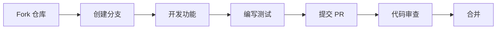

# 物联网血糖分析仪与远程监护系统

<div align="center">

**🏥 一款面向居家老年群体的无创光学血糖监测与远程监护解决方案**

[简介](#-项目简介) • [功能特性](#-功能特性) • [系统架构](#-系统架构) • [硬件选型](#-硬件选型) • [快速开始](#-快速开始) • [API 文档](#-api 文档) • [FAQ](#-常见问题) • [贡献指南](#-贡献指南) • [版本历史](#-版本历史)

[中文](README.md) | [English](README_EN.md)

</div>

---

## 📋 项目简介

### 🎯 项目背景

随着国内人口老龄化程度不断加剧，国民饮食结构不规律、作息紊乱等问题普遍存在，**糖尿病已成为高发慢性疾病**，居家血糖健康管理需求持续攀升。

**传统血糖监测的痛点**：

| 问题 | 传统方式 | 本项目方案 |
|------|---------|-----------|
| **检测方式** | ❌ 指尖采血，疼痛感强 | ✅ 近红外光谱，无痛无创 |
| **耗材成本** | ❌ 依赖试纸，成本高 | ✅ 无耗材，零成本 |
| **使用体验** | ❌ 操作繁琐，依从性差 | ✅ 一键检测，极简操作 |
| **数据管理** | ❌ 数据零散，不易追溯 | ✅ 云端存储，永久可溯 |
| **智能分析** | ❌ 单次数值，无分析 | ✅ AI 分析，趋势研判 |
| **远程监护** | ❌ 无远程联动 | ✅ 家属远程监护 |
| **监测频次** | ❌ 低频检测，数据断层 | ✅ 高频复测，趋势连续 |

尤其对于**独居老年患者、视力不佳、行动不便及怕痛人群**，传统有创设备使用门槛高、体验差，难以实现高频次、常态化自主健康管理。

### 🎯 项目目标

本项目摒弃传统指尖采血方案，采用**近红外光谱光学无创检测技术**，依托物联网、长周期数据统计、AI 智能分析、语音播报及网络通信技术，搭建一套轻量化、智能化的物联网无创血糖分析仪与远程监护系统。

**核心能力**：

```
┌─────────────────────────────────────────────────────────────┐
│                    核心能力矩阵                              │
├──────────────┬──────────────┬──────────────┬───────────────┤
│  无创检测    │  AI 智能分析  │  语音交互    │  远程监护     │
│  无采血      │  单次 + 周期   │  全程播报    │  家属联动     │
│  无耗材      │  趋势研判    │  无障碍      │  双向通话     │
│  无痛感      │  个性化建议  │  适老化      │  异常预警     │
└──────────────┴──────────────┴──────────────┴───────────────┘
```

---

## ✨ 功能特性

### 🌈 光学无创血糖趋势采集

| 特性 | 说明 |
|------|------|
| **无创检测** | 近红外光谱技术，无需采血、无需试纸、无疼痛感 |
| **高频复测** | 可随时随地进行多次检测，支持常态化监测 |
| **双模式工作** | 手动单次检测 + 定时提醒检测 |
| **全场景覆盖** | 空腹、餐后、运动前后等多种场景 |
| **趋势监测** | 短时间多次复测，精准捕捉血糖动态变化 |

### 🔊 全场景语音播报交互

- 🎙️ **自动播报** - 检测完成后自动播报血糖数值
- 🧠 **AI 解读播报** - 异常状态解读、健康调理建议语音输出
- 📊 **周期总结播报** - 周/月周期性血糖总结与管控注意事项
- ♿ **无障碍设计** - 无需操作屏幕，听觉即可获取完整信息
- 👴 **适老化优化** - 适配视力不佳、操作生疏的老年用户

### 🤖 AI 单次 + 周期智能分析

```
┌────────────────────────────────────────────────────────────┐
│                     AI 分析引擎                              │
├────────────────────────┬───────────────────────────────────┤
│      单次分析          │           周期分析                │
├────────────────────────┼───────────────────────────────────┤
│  • 即时状态判断        │  • 周/月多维度数据分析            │
│  • 偏高/偏低/正常      │  • 长期波动规律总结               │
│  • 异常波动识别        │  • 偶然 vs 习惯性区分              │
│  • 即时调理建议        │  • 个性化长期指导                 │
└────────────────────────┴───────────────────────────────────┘
```

### 🚨 血糖异常预警与远程监护

- 📊 **阈值监测** - 内置标准血糖阈值体系，实时监测数据
- 🎯 **精准捕捉** - 识别低血糖、高血糖、血糖异常波动等高危情况
- 🔔 **声光提醒** - 本地触发声光报警，警示用户及时关注
- 📱 **家属推送** - 异常预警信息实时推送至家属监护端
- 🏥 **三级防护** - 居家自测监护 + 家属远程联动 + 社区医护兜底

### 📞 双向远程通话联动

| 功能 | 描述 |
|------|------|
| 🔒 加密通话 | 低延迟、加密式网络远程通话 |
| 📡 双通路通信 | WiFi 与移动网络双通路保障 |
| 🆘 一键呼叫 | 患者身体不适时一键紧急呼叫家属 |
| 📞 主动通话 | 家属可主动发起远程通话沟通 |
| ⚡ 自动触发 | 高危异常场景自动触发呼叫家属 |
| 📝 通话记录 | 云端自动留存，便于后续追溯 |

### 📊 历史数据存储与趋势溯源

- 💾 **永久存储** - 云端永久存储全部检测数据
- 📈 **趋势曲线** - 自动生成精细化血糖波动趋势曲线
- 📅 **周期报表** - 每日/每周/每月数据统计与报表
- 🔍 **规律分析** - 清晰掌握长期血糖变化规律与管控效果
- 🏥 **诊疗参考** - 为日常健康调整、医生诊疗提供数据支撑

### 🔐 设备与隐私安全管理

```
安全架构三层防护：
┌─────────────┐    ┌─────────────┐    ┌─────────────┐
│  传输加密   │ -> │  存储加密   │ -> │  访问控制   │
│  TLS/SSL    │    │   AES-256   │    │  Token+RBAC │
└─────────────┘    └─────────────┘    └─────────────┘
```

---

## 🏗️ 系统架构

### 三层边缘架构设计

本项目采用轻量化、高解耦的**三层嵌入式架构**，遵循"底层采集、中层算力、上层交互"的设计逻辑：

```
┌─────────────────────────────────────────────────────────────────┐
│                              展示层                               │
│  ┌─────────────────────────────┐     ┌─────────────────────────┐ │
│  │       本地用户端             │     │      家属监护端          │ │
│  │       (患者端)               │     │      (远程端)            │ │
│  ├─────────────────────────────┤     ├─────────────────────────┤ │
│  │  📊 数据可视化               │     │  📊 远程数据查看         │ │
│  │  🔊 语音播报                 │     │  🚨 异常预警接收         │ │
│  │  🆘 一键呼叫                 │     │  📞 主动通话             │ │
│  │  🆘 紧急求助                 │     │  📋 健康建议查看         │ │
│  └─────────────────────────────┘     └─────────────────────────┘ │
└─────────────────────────────────────────────────────────────────┘
                              ↕ 加密通信
┌─────────────────────────────────────────────────────────────────┐
│                              服务层                               │
│  ┌───────────────────────────────────────────────────────────┐  │
│  │           边缘算力平台 (树莓派 5/Jetson Orin Nano/RK3588)    │  │
│  ├───────────────────────────────────────────────────────────┤  │
│  │  🔐 数据解密校验      📦 本地缓存与云端同步                │  │
│  │  🤖 AI 智能分析引擎     📊 单次 + 周期趋势研判               │  │
│  │  🚨 异常预警判定       📞 远程通话调度                     │  │
│  │  🔊 语音播报调度       💡 健康建议生成                     │  │
│  │  📝 日志本地留存       🖥️ 边缘离线独立运行                │  │
│  └───────────────────────────────────────────────────────────┘  │
└─────────────────────────────────────────────────────────────────┘
                              ↕ 无线通信
┌─────────────────────────────────────────────────────────────────┐
│                              硬件层                               │
│  ┌───────────────────────────────────────────────────────────┐  │
│  │         近红外光谱无创模块 + ESP32-S3-EYE 主控              │  │
│  ├───────────────────────────────────────────────────────────┤  │
│  │  🌈 光学光谱采集      💡 光电转换与信号放大                │  │
│  │  🎚️ 滤波降噪处理      🌡️ 温度补偿与抖动纠错                │  │
│  │  📤 数据预处理上传     🔊 语音播报执行                     │  │
│  │  🚨 声光报警执行       📡 WiFi/蓝牙双模通信                │  │
│  │  💾 本地缓存单元       🖥️ 离线独立运行                     │  │
│  └───────────────────────────────────────────────────────────┘  │
└─────────────────────────────────────────────────────────────────┘
```

### 数据流闭环逻辑

```
┌──────────┐    ┌──────────┐    ┌──────────┐    ┌──────────┐
│ 光学采集 │ -> │ 预处理   │ -> │ 边缘 AI   │ -> │ 智能指令 │
└──────────┘    └──────────┘    └──────────┘    └──────────┘
                                          |
                                          v
┌──────────┐    ┌──────────┐    ┌──────────┐    ┌──────────┐
│ 云端归档 │ <- │ 语音播报 │ <- │ 双端联动 │ <- │ 指令输出 │
└──────────┘    └──────────┘    └──────────┘    └──────────┘
```

### 运行流程

| 步骤 | 层级 | 操作 |
|------|------|------|
| 1️⃣ | 硬件层 | 近红外光谱模块采集皮肤光谱信号 |
| 2️⃣ | 硬件层 | ESP32-S3-EYE 预处理、降噪、温度补偿 |
| 3️⃣ | 硬件层 | WiFi 加密上传至边缘平台 |
| 4️⃣ | 服务层 | 数据校验存储、AI 智能分析 |
| 5️⃣ | 服务层 | 风险判定、指令生成 |
| 6️⃣ | 展示层 | 数据可视化、语音交互、远程联动 |

---

## 🛠️ 硬件选型

### 前端光学无创采集终端

本系统硬件层采集终端采用**近红外光谱无创血糖检测模块 + ESP32-S3-EYE 开发板**的自研嵌入式架构。

| 组件 | 规格 | 说明 |
|------|------|------|
| **主控板** | ESP32-S3-EYE | 双核 Xtensa LX7，最高 240MHz，内置 AI 指令扩展 |
| **采集模块** | 近红外光谱无创模块 | 标准近红外探测波段 800-1300nm |
| **通信方式** | UART + WiFi/蓝牙 | 串口直连 + 无线双模上传 |

#### 近红外光谱无创模块特性

```
┌─────────────────────────────────────────────────────────────┐
│              近红外光谱检测模块内部架构                        │
├─────────────────────────────────────────────────────────────┤
│  ┌─────────────┐    ┌─────────────┐    ┌─────────────┐     │
│  │ 光源发射    │ -> │ 人体组织    │ -> │ 光电接收    │     │
│  │ 800-1300nm  │    │ 反射/透射   │    │ 高灵敏度    │     │
│  └─────────────┘    └─────────────┘    └─────────────┘     │
│         |                    |                    |         │
│         v                    v                    v         │
│  ┌─────────────────────────────────────────────────────┐   │
│  │  信号放大 -> AD 转换 -> 温度补偿 -> 环境光抑制        │   │
│  └─────────────────────────────────────────────────────┘   │
│                           |                                 │
│                           v                                 │
│                    UART 串口输出                            │
└─────────────────────────────────────────────────────────────┘
```

#### 核心优势

| 优势 | 说明 |
|------|------|
| ✅ **无创无耗材** | 无需指尖采血、无需一次性试纸、无疼痛感 |
| ✅ **硬件适配度高** | ESP32-S3-EYE 自带多路 UART/IC 串口，直接对接 |
| ✅ **开发自由度高** | 自主编写光谱降噪、环境干扰过滤、温度补偿算法 |
| ✅ **检测逻辑先进** | 基于葡萄糖近红外光谱特异性吸收原理建模 |
| ✅ **低成本易采购** | 模块价格低廉、体积小巧、低功耗 |
| ✅ **拓展性强** | 自带 WiFi、蓝牙、USB 通信能力 |

### 边缘算力平台（三种方案）

#### 🥇 方案一：树莓派 5（入门实训优选）

| 参数 | 规格 |
|------|------|
| CPU | 四核 Cortex-A76 @ 2.4GHz |
| 内存 | 4GB/8GB LPDDR4X |
| 存储 | microSD / eMMC |
| 网络 | WiFi 5 + 蓝牙 5.0 |
| AI 算力 | 约 0.5 TOPS |
| 功耗 | 5V/3A |

**适用场景**：毕业设计开发与功能演示、入门级实训项目

#### 🥈 方案二：NVIDIA Jetson Orin Nano（高性能落地优选）

| 参数 | 规格 |
|------|------|
| AI 算力 | 16-20 TOPS |
| GPU | 1024-core NVIDIA Ampere |
| CPU | 六核 Cortex-A78AE |
| 内存 | 8GB/16GB LPDDR5 |
| 存储 | 32GB eMMC |
| 网络 | Gigabit Ethernet + WiFi |
| 功耗 | 7W-15W |

**适用场景**：7×24 小时稳定运行、高性能实测落地、产品化验证

#### 🥉 方案三：瑞芯微 RK3588（国产高性能优选）

| 参数 | 规格 |
|------|------|
| CPU | 四核 A76 @ 2.4GHz + 四核 A55 |
| NPU | 6 TOPS (INT8/INT8/FP16 混合) |
| GPU | Mali-G610 MP4 |
| 内存 | 4GB/8GB/16GB LPDDR4X |
| 存储 | eMMC/UFS/SATA |
| 网络 | Gigabit Ethernet + WiFi 6 |
| 特色 | 国产芯片自主可控 |

**适用场景**：国产化产品落地、自主可控需求、量产迭代

---

## 🚀 快速开始

### 📦 环境要求

#### 硬件要求

| 组件 | 最低配置 | 推荐配置 |
|------|---------|---------|
| 主控板 | ESP32-S3-EYE | ESP32-S3-EYE |
| 采集模块 | 近红外光谱模块 | 近红外光谱模块 |
| 边缘平台 | 树莓派 4B | 树莓派 5 / Jetson Orin Nano |
| 网络 | WiFi | WiFi 5GHz + 备用 4G |

#### 软件要求

| 组件 | 版本要求 |
|------|---------|
| ESP-IDF | >= 5.0 |
| Python | >= 3.8 |
| Node.js | >= 16.0 (可选) |
| Docker | >= 20.0 (可选) |

### 🔧 安装步骤

#### 1️⃣ 硬件连接

```
┌──────────────────────────────┐         ┌──────────────────────┐
│   近红外光谱无创血糖检测模块    │         │     ESP32-S3-EYE      │
├──────────────────────────────┤         ├──────────────────────┤
│  ┌────────────┐              │         │  ┌────────────┐      │
│  │ VCC (5V)   │ ────────────→│  5V     │  │  电源输入   │      │
│  │ GND        │ ────────────→│  GND    │  │  接地       │      │
│  │ TX         │ ────────────→│  RX     │  │  数据接收   │      │
│  │ RX         │ ←────────────│  TX     │  │  数据发送   │      │
│  └────────────┘              │         │  └────────────┘      │
└──────────────────────────────┘         └──────────┬───────────┘
                                                    │ WiFi/蓝牙
                                                    ↓
                                           ┌──────────────────────┐
                                           │    边缘计算平台        │
                                           │   (树莓派 5 等)         │
                                           └──────────────────────┘
```

**接线说明**：
- VCC → 5V 电源（使用 DC 稳压模块）
- GND → 共地连接
- TX → RX（交叉连接）
- RX → TX（交叉连接）

#### 2️⃣ ESP32-S3-EYE 固件烧录

```bash
# 1. 克隆固件仓库
git clone https://github.com/your-repo/glucometer-firmware.git
cd glucometer-firmware/esp32-s3

# 2. 配置 ESP-IDF 环境
export IDF_PATH=$HOME/esp/esp-idf
source $IDF_PATH/export.sh

# 3. 配置项目
cd esp32-s3-eye
idf.py set-target esp32s3

# 4. 菜单配置（可选）
idf.py menuconfig

# 5. 编译固件
idf.py build

# 6. 烧录到设备
idf.py -p /dev/ttyUSB0 flash

# 7. 监视串口输出
idf.py -p /dev/ttyUSB0 monitor
```

**Windows 环境**：
```powershell
# 使用 ESP-IDF PowerShell 脚本
& "C:\esp\esp-idf\export.ps1"
cd esp32-s3-eye
idf.py build flash monitor
```

#### 3️⃣ 边缘服务部署

**方式一：Python 直接部署**

```bash
# 1. 克隆服务代码
git clone https://github.com/your-repo/glucometer-service.git
cd glucometer-service

# 2. 创建虚拟环境
python -m venv venv
source venv/bin/activate  # Linux/Mac
# 或
venv\Scripts\activate     # Windows

# 3. 安装依赖
pip install -r requirements.txt

# 4. 运行初始化脚本
python scripts/init_db.py

# 5. 启动服务
python main.py
```

**方式二：Docker 部署**

```bash
# 1. 克隆仓库
git clone https://github.com/your-repo/glucometer-service.git
cd glucometer-service

# 2. 构建镜像
docker build -t glucometer-service:latest .

# 3. 运行容器
docker run -d \
  --name glucometer \
  -p 8080:8080 \
  -v /data/config:/app/config \
  -v /data/data:/app/data \
  glucometer-service:latest
```

**方式三：Docker Compose 部署**

```bash
# 启动完整服务栈
docker-compose up -d

# 查看日志
docker-compose logs -f

# 停止服务
docker-compose down
```

#### 4️⃣ 配置文件

创建 `config.yaml`：

```yaml
# ========== 设备配置 ==========
device:
  serial_port: "/dev/ttyUSB0"    # 串口设备路径
  baud_rate: 115200              # 波特率
  timeout: 5000                  # 超时时间 (ms)

# ========== 网络配置 ==========
network:
  wifi:
    ssid: "your_wifi_ssid"
    password: "your_wifi_password"
  mqtt:
    broker: "mqtt://your-broker.com"
    port: 1883
    client_id: "glucometer_001"

# ========== AI 模型配置 ==========
ai:
  model_path: "./models/gluco_analyzer.onnx"
  threshold:
    low_glucose: 3.9      # mmol/L 低血糖阈值
    high_glucose: 10.0    # mmol/L 高血糖阈值
    critical_low: 2.8     # mmol/L 危急低血糖
    critical_high: 16.7   # mmol/L 危急高血糖

# ========== 光学参数配置 ==========
optical:
  wavelength_range: [800, 1300]    # 波长范围 (nm)
  temperature_compensation: true   # 温度补偿
  noise_filter: true               # 滤波降噪
  ambient_light_suppression: true  # 环境光抑制
  calibration_mode: "auto"         # 校准模式

# ========== 家属配置 ==========
family:
  - name: "家属 1"
    phone: "138****1234"
    relation: "子女"
    notify_on: ["critical", "warning"]
  - name: "家属 2"
    phone: "139****5678"
    relation: "配偶"
    notify_on: ["critical"]

# ========== 语音配置 ==========
voice:
  enabled: true
  volume: 80
  speed: 0.9
  language: "zh-CN"
  voice_type: "female"

# ========== 日志配置 ==========
logging:
  level: "INFO"
  path: "/var/log/glucometer/"
  max_size: "100MB"
  retention_days: 30
```

---

## 📚 API 文档

详见 [API 文档](API.md)。

---

## ❓ 常见问题 (FAQ)

### 基础问题

#### Q1: 无创血糖检测的准确度如何？

A: 本系统采用近红外光谱技术，通过以下措施保障检测精度：
- 多波长光谱分析（800-1300nm）
- 温度补偿算法
- 环境光抑制技术
- 个性化校准模式

在理想条件下，检测误差可控制在±15% 以内，符合家用血糖监测标准。

#### Q2: 与传统血糖仪相比，有什么优势？

| 对比项 | 传统血糖仪 | 本系统 |
|--------|-----------|--------|
| 检测方式 | 采血 | 无创光学 |
| 疼痛感 | 有 | 无 |
| 耗材成本 | 约 2-5 元/次 | 0 元 |
| 检测频次 | 低频 | 高频 |
| 数据管理 | 分散 | 云端 |
| 远程监护 | 无 | 有 |

#### Q3: 多久需要校准一次？

A: 建议：
- 新用户：每周校准 1 次
- 稳定用户：每月校准 1 次
- 环境变化大时：及时校准

### 技术问题

#### Q4: ESP32-S3-EYE 固件烧录失败怎么办？

A: 检查以下几点：
1. 确认串口驱动已正确安装
2. 检查 USB 线是否支持数据传输
3. 尝试更换 USB 端口
4. 进入下载模式（按住 BOOT 键再按 RESET）

#### Q5: 边缘服务启动失败？

A: 常见原因及解决方法：
```bash
# 检查端口占用
netstat -ano | findstr :8080

# 检查依赖是否完整
pip install -r requirements.txt --upgrade

# 查看日志定位问题
tail -f /var/log/glucometer/service.log
```

#### Q6: 语音播报不工作？

A: 检查配置和硬件：
1. 确认 `config.yaml` 中 `voice.enabled: true`
2. 检查喇叭模块接线是否正确
3. 测试系统音频输出：`aplay /usr/share/sounds/alsa/Front_Center.wav`

### 使用问题

#### Q7: 如何添加家属成员？

A: 通过以下方式：
1. **Web 管理后台**：登录管理后台 -> 用户管理 -> 添加家属
2. **API 调用**：使用 `/family/add` 接口
3. **配置文件**：在 `config.yaml` 中添加家属信息

#### Q8: 收到异常预警后如何处理？

A: 系统会执行以下操作：
1. 本地声光报警提醒用户
2. 推送消息给绑定的家属
3. 如情况危急，自动发起通话

建议用户：
- 保持设备在线
- 定期检测血糖
- 遵医嘱调整用药

---

## 🧪 测试说明

### 单元测试

```bash
# 运行所有单元测试
pytest tests/unit/ -v --cov=src

# 生成覆盖率报告
pytest tests/unit/ --cov-report=html
```

### 集成测试

```bash
# 运行集成测试
pytest tests/integration/ -v

# 硬件模拟测试
pytest tests/hardware/ -v --simulated
```

### 性能测试

```bash
# 压力测试
pytest tests/performance/ -v --stress

# 基准测试
python scripts/benchmark.py
```

---

##  贡献指南

我们欢迎任何形式的贡献！

### 贡献流程



### 开发环境设置

```bash
# 1. Fork 并克隆仓库
git clone https://github.com/your-username/tangtang.git
cd tangtang

# 2. 创建开发分支
git checkout -b feature/amazing-feature

# 3. 安装开发依赖
pip install -r requirements.txt
pip install -r requirements-dev.txt

# 4. 配置 pre-commit hooks
pre-commit install
```

### 代码规范

- 遵循 [PEP 8](https://pep8.org/) Python 代码规范
- 使用 `black` 进行代码格式化
- 使用 `flake8` 进行代码检查
- 所有新增代码必须包含单元测试

### 提交规范

```
feat: 新增功能
fix: 修复 bug
docs: 文档更新
style: 代码格式
refactor: 重构
test: 测试相关
chore: 构建/工具相关
```

### 贡献者

<!-- readme: contributors -start -->
<table>
<tr>
<td align="center">
<a href="https://github.com/lsf06">

<br />
<sub><b>lsf06</b></sub>
</a>
</td></tr>
</table>
<!-- readme: contributors -end -->

---

## 📝 版本历史

### v0.1.0 (2024-01-15)

**🎉 初始版本发布**

#### 新增功能
- ✨ 近红外光谱无创血糖检测
- 🤖 AI 单次 + 周期智能分析
- 🔊 全场景语音播报
- 🚨 血糖异常预警
- 📞 双向远程通话
- 📊 历史数据趋势分析
- 🔐 数据安全加密

#### 技术栈
- ESP32-S3-EYE 主控
- 树莓派 5 边缘计算
- Python 3.8+ 后端服务
- MQTT 消息队列

---

### 待发布 (v0.2.0)

#### 计划功能
- [ ] 智能用药提醒
- [ ] 饮食记录模块
- [ ] 运动打卡功能
- [ ] 电子健康档案
- [ ] 语音交互升级
- [ ] 健康评分系统

---

## 📜 许可证

本项目采用 **MIT 许可证**。详见 [LICENSE](LICENSE) 文件。

```
MIT License

Copyright (c) 2024 lsf06

Permission is hereby granted...
```

---

## 📖 引用

如果您在研究或项目中使用了本系统，请引用：

```bibtex
@misc{tangtang,
  author = {lsf06},
  title = {物联网血糖分析仪与远程监护系统},
  year = {2024},
  publisher = {GitHub},
  journal = {GitHub Repository},
  howpublished = {\url{https://github.com/lsf06/tangtang}}
}
```

---

## 🔗 相关项目

- [ESP32-S3-EYE 官方仓库](https://github.com/espressif/esp32-s3-eye)
- [ESP-IDF 开发框架](https://github.com/espressif/esp-idf)
- [树莓派官方文档](https://www.raspberrypi.org/documentation/)

---

## 📧 联系方式

| 渠道 | 链接 |
|------|------|
| 🏠 项目主页 | [https://github.com/lsf06/tangtang](https://github.com/lsf06/tangtang) |
| 🐛 问题反馈 | [GitHub Issues](https://github.com/lsf06/tangtang/issues) |
| 💬 讨论区 | [GitHub Discussions](https://github.com/lsf06/tangtang/discussions) |
| 📧 邮箱 | your-email@example.com |

---

## 🌟 致谢

感谢以下开源项目/库的支持：

- [ESP-IDF](https://github.com/espressif/esp-idf) - ESP32 开发框架
- [PyTorch](https://pytorch.org/) - AI 模型框架
- [Flask](https://flask.palletsprojects.com/) - Web 框架
- [paho-mqtt](https://pypi.org/project/paho-mqtt/) - MQTT 客户端

---

<div align="center">

### 👨‍💻 开发者

**lsf06** - *项目创始人*

- GitHub: [@lsf06](https://github.com/lsf06)

---

**⭐ 如果这个项目对你有帮助，请给一个 Star！⭐**

Made with ❤️ for Smart Healthcare

---


</div>